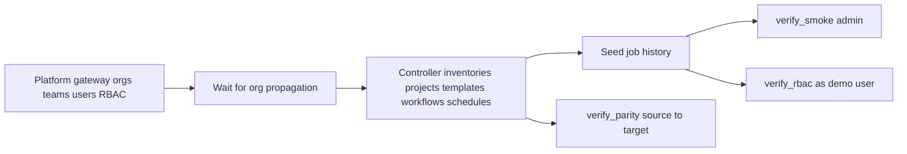

# AAP 2.5 demo bootstrap

This repository populates a fresh Ansible Automation Platform 2.5 installation with:

- three gateway-managed organizations and teams;
- six local demo users (two per organization) with team-scoped RBAC, so every user manages only their own organization's content;
- three controller inventories with synthetic hosts and groups;
- three SCM projects pointing back to this repository;
- five safe job templates, including a survey and a controlled failure;
- one workflow job template chaining two of the demo templates;
- one enabled weekly schedule, one webhook notification template pointing at
  a non-routable URL, one machine credential (fake password) attached to the
  surveyed platform-change template, and one label — so every object type
  compared by `verify_parity.yml` is exercised by seeded content (execution
  environments excepted: a custom EE needs a pullable image, and the default EEs
  already exercise that type);
- seeded successful and failed job history.

No task contacts a real managed host. Every synthetic host uses `ansible_connection: local`, and the content is limited to `debug`, `assert`, `set_stats`, and an intentional `fail` task.

## What's in this repo

| Path | Purpose |
|---|---|
| `bootstrap.yml` / `teardown.yml` | Seed and remove disposable `Demo` content |
| `verify_smoke.yml` | Layer 1 — admin smoke gate on one AAP |
| `verify_parity.yml` | Layer 2 — source→target content parity |
| `verify_functional.yml` | Layer 3 — curated functional checks |
| `verify_rbac.yml` | Layer 4 — restricted-user visibility (not covered by smoke) |
| `badpractice.yml` | Optional Default-organization anti-pattern demo |
| `export.yml` / `import.yml` | Supplemental controller object transfer (not a DB migration) |
| `config/demo.yml` | All seeded demo objects |
| `config/verify.yml` | Parity types and functional/RBAC defaults |
| `docs/` | Runtimes/prereqs, deployment options, migration verification, object transfer |

## Quickstart

The fastest path from an empty AAP 2.5 to fully seeded demo content, run with
host-native `ansible-playbook`. Using an execution environment instead, or on
RHEL 8 (whose stock Python 3.6 can't run ansible-core 2.16)? See
[docs/runtimes-and-prerequisites.md](docs/runtimes-and-prerequisites.md).

**You need:** an AAP 2.5 installation reachable over HTTPS with a platform-admin
credential you can use temporarily; a Git repository the AAP controller can
reach, holding a copy of this repo; and a control node with Python 3.10–3.12.

**1. Publish this repository.** Push the complete directory to a Git repository
the controller can reach — the demo projects use it as their SCM source.

**2. Install the AAP-matched collections.**

```bash
ansible-galaxy collection install -r requirements.yml
ansible-galaxy collection list | grep -E 'ansible\.(platform|controller)'
```

Expect `ansible.platform 2.5.x` and `ansible.controller 4.6.x`. Version-pin
details are in [docs/runtimes-and-prerequisites.md](docs/runtimes-and-prerequisites.md).

**3. Export bootstrap authentication.** Use the platform gateway URL, not a
controller URL.

```bash
export AAP_HOSTNAME='https://aap.example.com'
export AAP_USERNAME='admin'
export AAP_PASSWORD='REDACTED'
export AAP_VALIDATE_CERTS='true'
```

`bootstrap.yml` refuses plain HTTP or disabled certificate validation before
sending the admin credential. For a private CA, install CA trust rather than
disabling validation.

**4. Provide the demo user password.** The shared password for all six demo
users comes only from a Vault-encrypted secrets file (gitignored):

```bash
cp config/secrets.example.yml config/secrets.yml
vi config/secrets.yml                    # set demo_user_password
ansible-vault encrypt config/secrets.yml
```

*Mapping teams to an external IdP instead? Skip this step and deploy without
local users — see [docs/deployment-options.md](docs/deployment-options.md).*

**5. Run the bootstrap.** Replace `<commit-sha-or-immutable-tag>` with a fixed
ref that contains this content; reuse the same ref for configuration-only reruns
so a moving branch tip can't change what is converged.

```bash
ansible-playbook bootstrap.yml \
  -e demo_scm_url='https://git.example.com/automation/aap25-demo-bootstrap.git' \
  -e demo_scm_branch='<commit-sha-or-immutable-tag>' \
  -e @config/secrets.yml --ask-vault-pass
```

On a fresh instance the task *Wait for gateway organizations to propagate to the
controller* can pause for up to 15 minutes — that is the periodic
gateway-to-controller resource sync, not a hang. The play continues as soon as
all three organizations are visible on the controller.

**6. Check the result.** In the unified UI, confirm three `Demo *` organizations
and teams, three inventories, three successfully synced projects, five job
templates, one workflow template, one enabled schedule, one notifier, one machine
credential, and a job list with both successful runs and one intentional failure.
For a scriptable check:

```bash
ansible-playbook verify_smoke.yml
```

The full checklist and the no-users variant are in
[docs/deployment-options.md](docs/deployment-options.md).

**Remove the demo content when finished:**

```bash
ansible-playbook teardown.yml
```

## Beyond the quickstart

- **Deploy without local users, re-run without new job history, lab-only
  overrides, and the full post-bootstrap checklist** —
  [docs/deployment-options.md](docs/deployment-options.md).
- **Execution-environment runtime and control-node prerequisites (incl. RHEL 8)** —
  [docs/runtimes-and-prerequisites.md](docs/runtimes-and-prerequisites.md).
- **Migration verification (AAP 2.5 RPM → AAP 2.5 on OpenShift): smoke, parity,
  functional, and RBAC layers plus the operator runbook** —
  [docs/migration-verification.md](docs/migration-verification.md).
- **Supplemental controller object transfer (export/import — not a database
  migration)** —
  [docs/controller-object-transfer.md](docs/controller-object-transfer.md).
- **The Default-organization anti-pattern demo (`badpractice.yml`)** —
  [docs/deployment-options.md](docs/deployment-options.md#optional-the-default-organization-anti-pattern).
- `config/demo.yml` defines every seeded object; edit it to change the demo content.

## Architecture (gateway → controller → verify)



- Gateway-managed identity/access objects are created first; controller objects wait until organizations are visible on `/api/controller/v2/organizations/`.
- Admin smoke proves availability and seeded content; it does **not** prove RBAC.
- Restricted-user RBAC authenticates **as** each configured demo user.
- Parity compares a read-only source gateway/controller to a target.

## Security and lifecycle notes

- Do not insert demo records directly into PostgreSQL.
- Leave the built-in `Default` organization alone. Every organization-scoped
  resource this repository creates lives in the three named demo organizations
  from `config/demo.yml`, and `teardown.yml` removes exactly that set — so the
  bootstrap never touches `Default`, and teardown scope always matches creation
  scope for that content. Keep it that way: do not attach demo content to
  `Default` and do not grant roles in it. `Default` cannot be deleted, so
  anything placed there outlives every cleanup. The one deliberate, documented
  exception is `badpractice.yml`, which seeds `Bad Demo` / `baddemo-` prefixed
  content into `Default` precisely to demonstrate this anti-pattern — and carries
  its own undo (`-e badpractice_state=absent`); see
  [docs/deployment-options.md](docs/deployment-options.md#optional-the-default-organization-anti-pattern).
- Demo user accounts are the one exception to organization scoping: gateway
  users are global identities created and removed by username (organization
  access is granted separately through role assignments). If a configured
  username already exists on the gateway, the bootstrap updates that account and
  the teardown deletes it — keep the `demo-` username prefix from
  `config/demo.yml` to avoid colliding with real accounts.
- Do not copy project content into controller container filesystems.
- Keep demo objects prefixed with `Demo` so they can be identified and removed.
- Keep real secrets out of this repository. Add real credentials only through an approved secret-management workflow.
- Demo users are local gateway accounts intended for throwaway demo environments. Their shared password comes only from the Vault-encrypted `config/secrets.yml`, which is gitignored. For production-like demos, disable local users (`-e demo_create_users=false`) and map the teams to your external identity provider groups instead.
